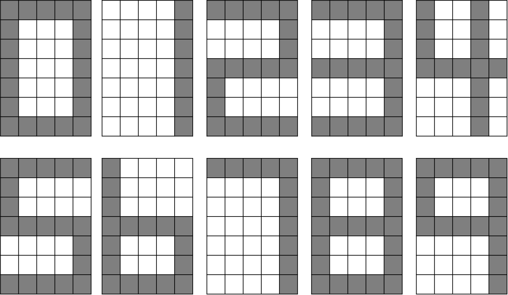
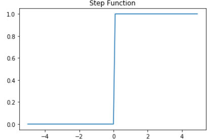
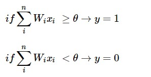
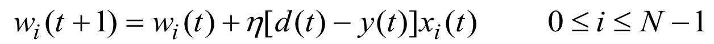
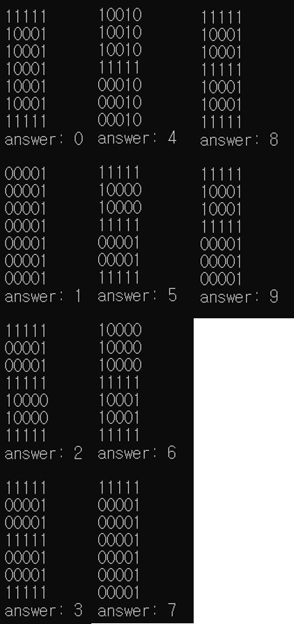
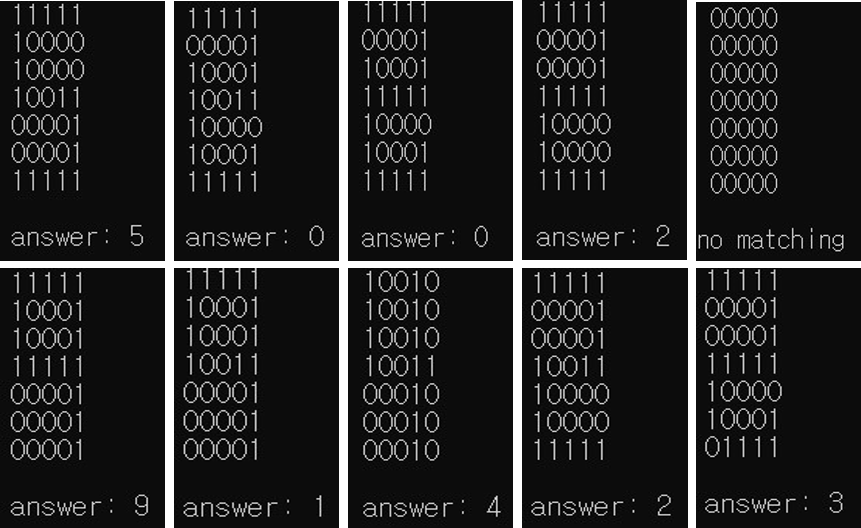

# number-recognition-system

number-recognition-system by perceptron


## Data set

from 0 to 9 (7 x 5 Matrix)



## Steps

### 1. initialize weight and threshold

- weight = initialize 4 X 35 Matrix by 0.5
- threshold = 0

### 2. target value setting

distinguish from 0 to 9 by 4 bits

0: -1 -1 -1 -1 

1: -1 -1 -1 1 

2: -1 -1 1 -1 

3: -1 -1 1 1 

4: -1 1 -1 -1 

5: -1 1 -1 1 

6: -1 1 1 -1

7: -1 1 1 1 

8: 1 -1 -1 -1

9: 1 -1 -1 1 

10: 1 -1 1 -1

### 3. weight update

#### Activate Function





#### Update Function



## Result Weight

[[-7.5 2.5 2.5 -1.5 -3.5 4.5 0.5 0.5 -3.5 4.5 4.5 0.5 0.5 -3.5 4.5 -7.5 10.5 10.5 10.5 -13.5 4.5 0.5 0.5 -3.5 2.5 4.5 0.5 0.5 -3.5 2.5 -3.5 -3.5 -3.5 -7.5 -9.5],
[14.5 0.5 0.5 2.5 -5.5 -3.5 0.5 0.5 2.5 -17.5 -3.5 0.5 0.5 2.5 -17.5 -5.5 -3.5 -3.5 -3.5 8.5 -9.5 0.5 0.5 2.5 6.5 -9.5 0.5 0.5 2.5 6.5 0.5 0.5 0.5 2.5 6.5],
[20.5 -1.5 -1.5 -3.5 -15.5 -23.5 0.5 0.5 -1.5 -5.5 -23.5 0.5 0.5 -1.5 -5.5 0.5 2.5 2.5 2.5 6.5 -1.5 0.5 0.5 -1.5 -1.5 -1.5 0.5 0.5 -1.5 -1.5 2.5 2.5 2.5 0.5 8.5],
[-1.5 2.5 2.5 0.5 4.5 -3.5 0.5 0.5 -1.5 4.5 -3.5 0.5 0.5 -1.5 4.5 -1.5 0.5 0.5 0.5 0.5 -5.5 0.5 0.5 -1.5 4.5 -5.5 0.5 0.5 -1.5 4.5 -1.5 -1.5 -1.5 -3.5 2.5]]

## Checking



## Testing



## Code

### Update Weight

weight update function

it's learning step

```c++
bool learning(vector<int> numV, vector<int> answerV) {
	vector<int> tmpAnswer(4);
	for (int i = 0; i < 4; i++) {
		int tmpSum = 0;
		for (int j = 0; j < 35; j++) {
			tmpSum += numV[j] * W[i][j];
		}
		if (tmpSum >= threshold) tmpAnswer[i] = 1;
		else tmpAnswer[i] = -1;
	}

	int tmpCount = 0;
	for (int i = 0; i < 4; i++) {
		if (tmpAnswer[i] == answerV[i]) tmpCount++;
		else {
			for (int j = 0; j < 35; j++) {
				W[i][j] += n * (answerV[i] - tmpAnswer[i]) * numV[j];
			}
		}
	}
	if (tmpCount == 4) return true;
	else return false;
}
```

### Checking

checking function

```c++
void checking(vector<int> sampleV) {
	vector<int> tmpAnswer(4);
	for (int i = 0; i < 4; i++) {
		int tmpSum = 0;
		for (int j = 0; j < 35; j++) {
			tmpSum += sampleV[j] * W[i][j];
		}
		if (tmpSum >= threshold) tmpAnswer[i] = 1;
		else tmpAnswer[i] = -1;
	}
	
	for (int j = 0; j < 10; j++) {
		int tmpCount = 0;
		for (int i = 0; i < 4; i++) {
			if (tmpAnswer[i] == answer[j][i]) tmpCount++;
		}
		if (tmpCount == 4) {
			cout << "answer: " << j << endl;
			return;
		}
	}
	cout << "no matching" << endl;
	return;
}
```

